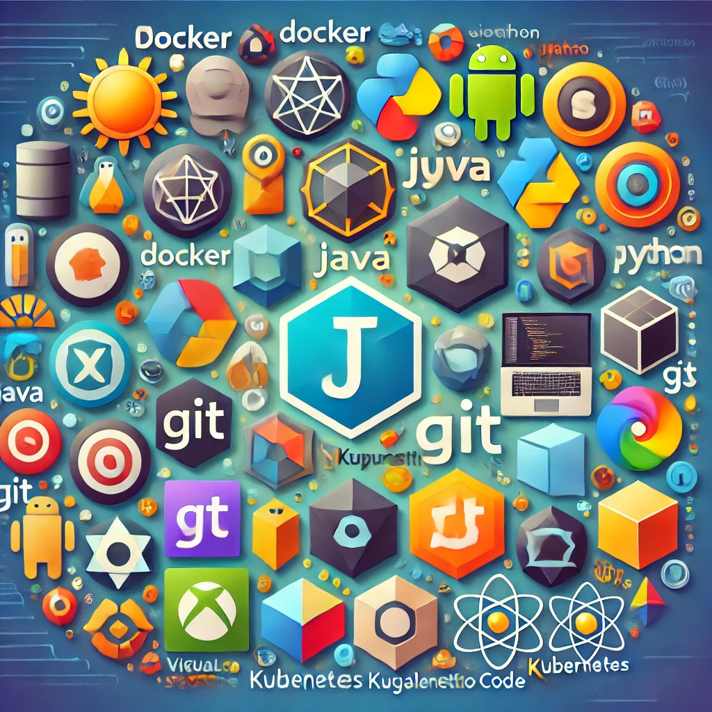
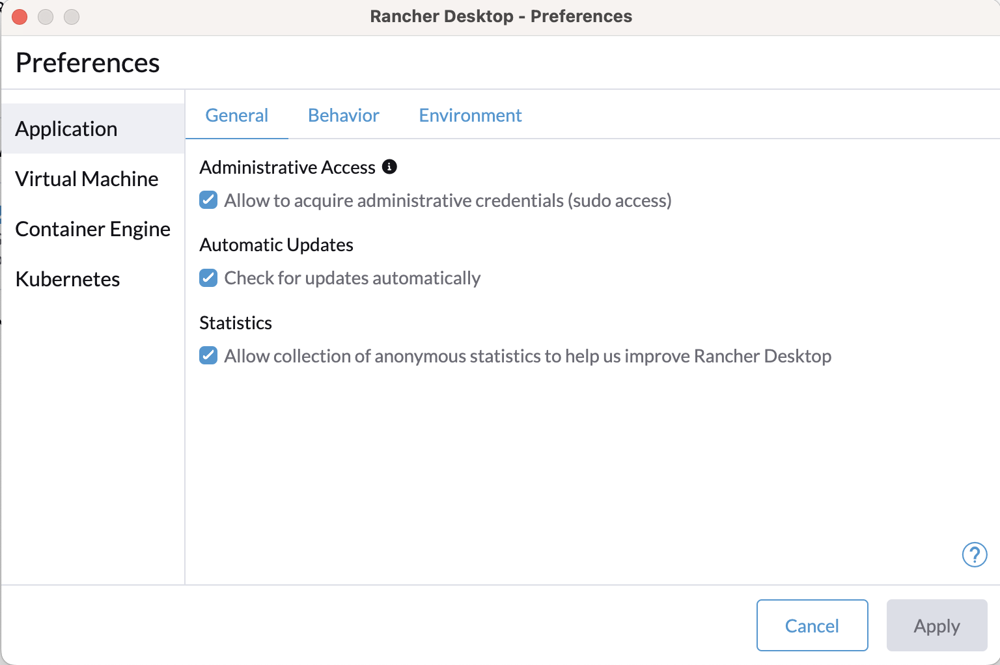

I am not a professional developer, I do it for fun. And I like to play around, discover new technologies,. development all kinds of little things. So sometimes I need Python, sometimes React/Typescript, Java and more. For every development tool or langugae there are multiple options on how to install them and manage their versions. Since I tend to forget things like "How did I install Python oin this machine?", this is a note to future me, telling me how I installed every development tool.

- [Docker](#docker)
- [Gradle](#gradle)
- [Java \& Maven](#java--maven)
  - [Maven](#maven)
- [Node and npm](#node-and-npm)
- [Python](#python)
- [Ruby](#ruby)

## Docker
I switched away from [Docker Desktop](https://www.docker.com/products/docker-desktop/) to [Rancher Desktop](https://rancherdesktop.io).

Installation note: Downloaded the Apple Silicon version, opened the DMG and copied it into my Applications directory. The only detail I needed to do, is tick the "Administrative Access" checkbox in the setting.

*Registry*: I use different registries when working on different projects. 

*Question*: How do I configure docker so that it pulls images from a specific registry?

## Gradle

## Java & Maven

### Maven
I simply use `brew install maven`. For older version `brew install maven30` installs Maven 3.0.

## Node and npm

In 2025 I decided to use [nvm](https://github.com/nvm-sh/nvm). 

## Python

## Ruby

